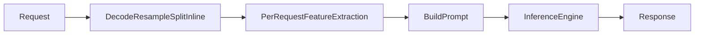
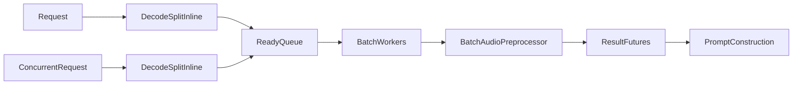
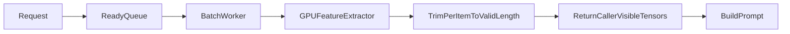
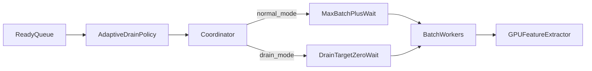
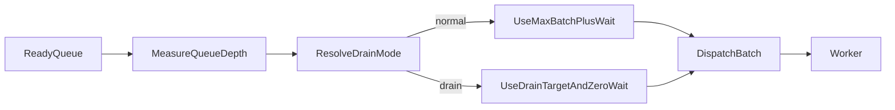
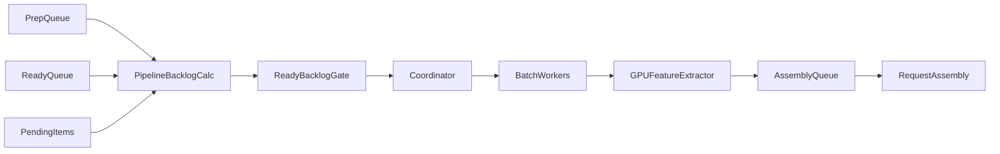
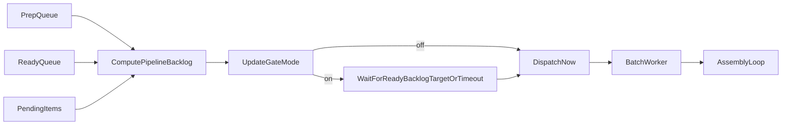

# ASR Microbatching Design

## Purpose

This document specifies a complete, implementation-grade design for an
automatic-speech-recognition preprocessing pipeline that evolves through six
feature stages:

1. `async MB`
2. `async MB + gpu`
3. `async MB + gpu + batch coordinator`
4. `async MB + gpu + batch coordinator + adaptive`
5. `async MB + gpu + batch coordinator + adaptive + multistage`
6. `async MB + gpu + batch coordinator + adaptive + multistage + backlog`

The intended reader is an engineer or agent that must rebuild the system
without access to the original codebase. Every section therefore separates
portable design requirements from implementation choices that are specific to
the current reference repository.

## End-to-End System Summary

At a high level, the system accepts uploaded audio bytes, decodes them into
waveforms, optionally splits long audio into chunks, converts chunks into model
input features, attaches those features to prompts, and submits the prompts to
the inference engine. The feature stages in this document progressively move
more of that work out of the request thread and into shared asynchronous queues.


## Common Vocabulary

- `request`: One end-user speech-to-text API call. A request may become one or
  more audio chunks.
- `chunk`: One contiguous waveform segment that is short enough for the model's
  maximum audio clip length.
- `preprocess batch`: A batch of chunks from one or more requests that are fed
  together into the model-side audio feature extractor.
- `prep stage`: CPU-side work that turns raw uploaded bytes into waveform
  chunks. This includes decode, resample, and chunk splitting.
- `ready stage`: The queue that holds chunk work items which are already decoded
  and are ready for feature extraction.
- `coordinator`: A central async task that decides when to dispatch a batch to
  a worker.
- `drain mode`: A high-backlog policy that intentionally emits smaller batches
  with zero wait to keep workers busy and reduce coordination latency.
- `ready backlog gate`: A policy that temporarily delays dispatch so the ready
  queue can accumulate a denser batch.
- `model-side preprocessor contract`: The interface implemented by the model
  layer to convert `List[WaveformChunk]` into `List[PreprocessedChunk]`.

## Common System Interfaces

The following interfaces are the portable contract. Names can change in a new
codebase, but the behavior should remain the same.

### Request Ingress

```text
handleSpeechRequest(audioBytes, requestConfig) -> (enginePrompts, totalDurationSeconds)
```

Behavior:

- Reads raw uploaded bytes.
- Validates request metadata and file size.
- Produces one or more engine prompts.
- Returns prompts plus total audio duration.

### Decode and Split

```text
decodeAndSplitAudio(audioBytes, audioConfig) -> PreparedAudio
```

Input:

- `audioBytes`: Encoded file bytes.
- `audioConfig`: Sample rate, max clip duration, overlap policy, split policy.

Output:

- `PreparedAudio.chunks`: ordered list of waveform arrays
- `PreparedAudio.durationSeconds`: duration of original audio
- `PreparedAudio.timing`: decode, resample, and split timing

Reference-compatible behavior:

- Decode the uploaded bytes without changing sample rate on the first pass.
- If primary decode fails for container-format reasons, use an in-process
  fallback decoder.
- If the decoded sample rate differs from the model sample rate, resample before
  chunking.
- If chunking is enabled and duration exceeds `maxAudioClipSeconds`, split into
  overlapping chunks according to the configured overlap and energy-based split
  policy.
- Otherwise emit exactly one chunk.

### Model-Side Batch Preprocessor

```text
batchPreprocessAudioChunks(chunks, modelConfig) -> preprocessedChunks
```

Input:

- `chunks`: ordered list of mono waveform arrays
- `modelConfig`: feature extractor and model configuration

Output for each chunk:

- `inputFeatures`: trimmed tensor `[1, featureDim, timeSteps]`
- `length`: tensor `[1]` containing valid frame count
- `numAudioTokens`: tensor `[1]`, usually `ceil(length / subsamplingFactor)`

Portable invariants:

- Each item must be trimmed to its own valid frame length.
- Batch padding may exist internally, but must not leak into the per-item
  output contract.
- The returned item order must match the input chunk order.

### Optional Persistent Preprocessor Factory

```text
createAudioMicrobatchPreprocessor(modelConfig) -> workerLocalPreprocessor
```

Purpose:

- Avoid recreating expensive feature extractor state for every batch.
- Initialize one reusable model-side preprocessor per worker thread.

### Async Preprocessor Public Surfaces

```text
preprocess(chunk) -> preprocessedChunk
prepare(audioBytes) -> PreparedRequestHandle
```

`preprocess(chunk)` is the single-chunk async entrypoint.

`prepare(audioBytes)` is the multistage entrypoint. It returns:

```text
PreparedRequestHandle:
  chunks
  durationSeconds
  preprocessedChunksFuture
```

## Common Data Model

Use these conceptual records even if field names differ.

```text
PreprocessedChunk:
  inputFeatures
  length
  numAudioTokens

PreparedAudio:
  chunks
  durationSeconds
  timing

ChunkWorkItem:
  chunk
  enqueueTime
  resultFuture?            # direct single-chunk path
  requestState?            # multistage assembly path
  chunkIndex?

RequestState:
  chunks
  durationSeconds
  preprocessedChunksFuture
  pendingResultsByIndex
  remainingChunkCount
```

## Baseline (No Async MB)

This baseline is the synchronous reference point that all later stages improve
upon. Each request performs decode, optional split, feature extraction, and
prompt construction in its own request context without any cross-request shared
queueing or batching.

At-a-glance architecture:



Key properties:

- No cross-request batching.
- No shared ready queue.
- No worker-slot coordination.
- No adaptive drain, multistage prep, or ready-backlog gating.
- Throughput is limited by how much preprocessing each request can do alone.

## 1. Async MB

At-a-glance architecture:



### 1.1 Feature Overview

#### What problem this feature solves

Per-request preprocessing wastes throughput when many requests arrive together.
Without a shared async batcher, every request performs feature extraction in
isolation and cannot amortize model-side preprocessing overhead across requests.

#### How it solves

It introduces a shared asynchronous preprocessing service with:

- one ready queue for chunk work items
- one or more worker threads
- time-bounded batch collection
- a model-side batch preprocessing function

Workers collect chunks from different requests, preprocess them in one batch,
then complete per-request futures.

#### Inputs / outputs

System-level input:

- decoded waveform chunks
- batching policy: `maxBatchSize`, `batchWaitTimeout`
- model-side preprocessor contract

System-level output:

- one `PreprocessedChunk` per input chunk
- prompt-ready audio feature objects

#### Constraints and assumptions

- The model must expose a batch preprocessing contract.
- Returned items must preserve input order.
- Before the multistage feature is added, decode and split still happen inline
  in the request path.
- In the current reference integration, single-chunk requests use the shared
  async queue directly, while multi-chunk requests may still preprocess
  synchronously inside the request path. That distinction is incidental, not a
  fundamental requirement of async MB itself.

### 1.2 Core Abstractions

#### Key concepts

- `AsyncPreprocessor`: owns queue, worker threads, and policy.
- `ChunkWorkItem`: one chunk waiting for preprocessing.
- `BatchWorker`: consumes chunk batches and invokes the model-side preprocessor.
- `ResultFuture`: delivers a chunk result back to the caller.

#### Essential logic

- Shared queue of chunk work items.
- Batch collection by size and wait timeout.
- Per-item futures so callers can await exactly their own result.
- One output item per input chunk in original order.

#### Incidental implementation details

- Environment variable names.
- Python `asyncio.Queue`, `Future`, and `ThreadPoolExecutor`.
- Exact logging and metrics classes.
- Specific request path decision to use async only for single-chunk requests.

### 1.3 Execution Flow

1. The request handler decodes uploaded audio bytes into waveform chunks.
2. If the request has one chunk and async MB is enabled, the handler calls
   `preprocess(chunk)`.
3. `preprocess(chunk)` creates a `ChunkWorkItem` and a `resultFuture`.
4. The work item is enqueued into the shared ready queue.
5. A worker waits for the first item, then starts batch collection.
6. The worker keeps collecting until one of two things happens:
   - batch size reaches `maxBatchSize`
   - wait time reaches `batchWaitTimeout`
7. The worker calls `batchPreprocessAudioChunks(batchChunks, modelConfig)`.
8. Results are matched back to the original work items by index.
9. Each caller awaits its own future and receives a `PreprocessedChunk`.
10. The request handler attaches the result to prompt construction and continues
    to inference.

Concurrency behavior:

- Many request coroutines enqueue concurrently.
- Each worker batches independent chunks from multiple requests.
- The heavy feature extraction runs off the event loop in worker threads.

### 1.4 Interfaces & Contracts

#### Language-agnostic interfaces

```text
AsyncPreprocessor.preprocess(chunk) -> Future[PreprocessedChunk]
BatchPreprocessor.batchPreprocess(chunks, modelConfig) -> List[PreprocessedChunk]
```

#### Expected inputs, outputs, and side effects

- Input: one waveform chunk, already decoded and resampled.
- Output: one preprocessed chunk.
- Side effects: queue insertion, worker-thread execution, metrics update.

#### Preconditions

- The chunk must be a mono numeric waveform array.
- The model-side batch preprocessor must be available.
- The async preprocessor service must be initialized before requests arrive.

#### Postconditions

- Exactly one future is resolved for the chunk.
- The returned feature object is trimmed to valid length.
- The worker leaves no orphaned work items in normal operation.

### 1.5 Key Algorithms / Logic

Core algorithm: time-bounded batch collection.

```text
function collectBatch(queue, maxBatchSize, waitTimeout):
    batch = [await queue.get()]
    deadline = now() + waitTimeout
    while size(batch) < maxBatchSize:
        remaining = deadline - now()
        if remaining <= 0:
            break
        item = tryAwait(queue.get(), remaining)
        if item timed out:
            break
        batch.append(item)
    return batch
```

Why this design:

- It avoids waiting indefinitely for a full batch.
- It captures burstiness under load.
- It preserves low-latency behavior when the queue is sparse.

### 1.6 State & Data Model

Maintained state:

- ready queue of chunk work items
- one worker-local preprocessor per worker, if supported
- per-item futures
- optional stats counters

Lifecycle:

1. create work item
2. enqueue work item
3. dequeue into a batch
4. preprocess and produce per-item results
5. resolve futures
6. release transient batch memory

### 1.7 Dependencies on Environment

Runtime assumptions:

- async event loop
- worker-thread execution for heavy preprocessing
- numeric array and tensor runtime

Framework assumptions:

- none are fundamental beyond async queues, futures, and a tensor library

External system assumptions:

- audio requests arrive through an HTTP or RPC layer
- inference engine accepts prompts carrying preprocessed audio features

Must be replicated:

- queue-based batching
- order-preserving per-item result delivery
- batch preprocessor contract

Can be replaced:

- concrete async framework
- HTTP layer
- exact logging and metrics subsystem

### 1.8 Reimplementation Guide

1. Implement `decodeAndSplitAudio`.
2. Define `PreprocessedChunk` output schema.
3. Implement a model-side `batchPreprocess(chunks)` function.
4. Build an async service with one ready queue and N workers.
5. Add `preprocess(chunk)` that enqueues one work item and awaits its future.
6. Integrate the result into prompt construction.

Suggested module breakdown:

- `audio_ingress`
- `audio_decode`
- `audio_batching`
- `audio_model_preprocessor`
- `speech_request_handler`

Common pitfalls:

- returning padded outputs instead of trimmed outputs
- losing input order within a batch
- blocking the event loop with heavy feature extraction
- not propagating worker exceptions to waiting callers

How to run it:

Reference `vllm serve` command for this stage:

```shell
FLASHINFER_DISABLE_VERSION_CHECK=1 \
CUDA_VISIBLE_DEVICES=1 \
VLLM_COHERE_ASR_CROSS_REQUEST_AUDIO_MICROBATCH=1 \
COHERE_ASR_MICROBATCH_PREPROCESS_DEVICE=cpu \
HF_PROCESSOR_NUM_THREADS=16 \
CROSS_REQUEST_AUDIO_MICROBATCH_NUM_WORKERS=8 \
CROSS_REQUEST_AUDIO_MICROBATCH_MAX_BATCH_SIZE=512 \
CROSS_REQUEST_AUDIO_MICROBATCH_MAX_TOTAL_TORCH_THREADS=64 \
CROSS_REQUEST_AUDIO_MICROBATCH_WAIT_TIMEOUT_S=0.002 \
VLLM_COHERE_ASR_CROSS_REQUEST_AUDIO_MICROBATCH_ADAPTIVE_DRAIN=0 \
VLLM_COHERE_ASR_CROSS_REQUEST_AUDIO_MICROBATCH_BATCH_COORDINATOR=0 \
VLLM_COHERE_ASR_CROSS_REQUEST_AUDIO_MICROBATCH_STATS=1 \
CROSS_REQUEST_AUDIO_MICROBATCH_STATS_LOG_EVERY_BATCHES=200 \
vllm serve ${MODEL_ID} --trust-remote-code --port ${PORT}
```

Which env vars affect this feature and how:

- `VLLM_COHERE_ASR_CROSS_REQUEST_AUDIO_MICROBATCH=1`: enables the shared async
  cross-request microbatch preprocessor. This is the defining switch for the
  stage.
- `COHERE_ASR_MICROBATCH_PREPROCESS_DEVICE=cpu`: keeps model-side feature
  extraction on CPU, which makes this the CPU async-MB variant rather than the
  GPU one.
- `HF_PROCESSOR_NUM_THREADS=16`: requests more per-worker torch threads for
  preprocessing. In practice the effective thread count can be reduced by the
  global cap below.
- `CROSS_REQUEST_AUDIO_MICROBATCH_NUM_WORKERS=8`: creates eight async
  preprocessing workers.
- `CROSS_REQUEST_AUDIO_MICROBATCH_MAX_BATCH_SIZE=512`: upper bound on the batch
  size one worker may preprocess at once.
- `CROSS_REQUEST_AUDIO_MICROBATCH_MAX_TOTAL_TORCH_THREADS=64`: global cap across
  all workers for torch thread usage.
- `CROSS_REQUEST_AUDIO_MICROBATCH_WAIT_TIMEOUT_S=0.002`: the worker waits up to
  2 ms to densify a batch before preprocessing it.
- `VLLM_COHERE_ASR_CROSS_REQUEST_AUDIO_MICROBATCH_BATCH_COORDINATOR=0`: keeps
  the coordinator off, so workers batch directly from the shared ready queue.
- `VLLM_COHERE_ASR_CROSS_REQUEST_AUDIO_MICROBATCH_ADAPTIVE_DRAIN=0`: keeps
  adaptive drain off.
- `VLLM_COHERE_ASR_CROSS_REQUEST_AUDIO_MICROBATCH_STATS=1` and
  `CROSS_REQUEST_AUDIO_MICROBATCH_STATS_LOG_EVERY_BATCHES=200`: enable
  observability only; they do not change batching behavior.

How to validate:

- send concurrent short requests
- verify batches form across requests and outputs remain correct

### 1.9 Minimal Reference Implementation

```python
class AsyncPreprocessor:
    def __init__(self, batch_preprocess, max_batch_size, wait_timeout, workers):
        self.batch_preprocess = batch_preprocess
        self.max_batch_size = max_batch_size
        self.wait_timeout = wait_timeout
        self.queue = AsyncQueue()
        self.workers = [spawn(self.worker_loop) for _ in range(workers)]

    async def preprocess(self, chunk):
        fut = Future()
        await self.queue.put({"chunk": chunk, "future": fut, "enqueued_at": now()})
        return await fut

    async def worker_loop(self):
        while True:
            batch = await collect_batch(
                self.queue, self.max_batch_size, self.wait_timeout
            )
            chunks = [item["chunk"] for item in batch]
            results = await run_in_worker_thread(self.batch_preprocess, chunks)
            for item, result in zip(batch, results):
                item["future"].set_result(result)
```

### 1.10 Flow Diagram

```mermaid
flowchart LR
    req[Request] --> decode[DecodeSplitInline]
    decode --> enqueue[EnqueueChunkWorkItem]
    enqueue --> readyQ[ReadyQueue]
    readyQ --> worker[BatchWorker]
    worker --> batch["CollectUntilSizeOrTimeout"]
    batch --> model["BatchAudioPreprocessor"]
    model --> future[ResolveChunkFuture]
    future --> prompt[BuildPrompt]
```



## 2. Async MB + GPU

At-a-glance architecture:


### 2.1 Feature Overview

#### What problem this feature solves

CPU feature extraction becomes the next bottleneck once requests are batched
across calls. The GPU stage moves the expensive feature-extraction math off CPU.

#### How it solves

It keeps the same async batching architecture but changes the model-side
preprocessor so feature extraction can execute on GPU.

#### Inputs / outputs

Input:

- same chunk batches as Stage 1
- model preprocessor device selection

Output:

- same logical `PreprocessedChunk` objects
- current reference implementation still converts results back to CPU tensors
  before returning them to the serving layer

#### Constraints and assumptions

- GPU execution is optional; the public contract is device-agnostic.
- The feature extractor must preserve the same numerical recipe and output
  schema regardless of device.
- In the current reference implementation, GPU execution accelerates feature
  extraction but does not keep the returned features resident on GPU.

### 2.2 Core Abstractions

#### Key concepts

- `FeatureExtractorDevice`
- `PersistentWorkerPreprocessor`
- `TrimmedFeatureFormatter`

#### Essential logic

- Same queue and batching behavior as Stage 1.
- Same per-item output schema.
- The per-item output must still be trimmed to its own valid length.

#### Incidental implementation details

- Current reference code uses a device env var and a persistent extractor
  factory to cache GPU-side initialization.
- Current implementation copies the final tensors to CPU before returning.

### 2.3 Execution Flow

1. Requests still enqueue chunk work items exactly as in Stage 1.
2. A worker collects a batch.
3. The worker invokes the model-side batch preprocessor on GPU.
4. The feature extractor pads inputs internally, runs the signal pipeline on
   GPU, computes valid lengths, and optionally copies results to CPU.
5. The formatter trims each batch item to its own valid frame length.
6. The worker resolves futures with per-item feature objects.
7. Prompt construction proceeds unchanged.

Concurrency behavior:

- Async behavior is unchanged.
- The main delta is compute placement, not queue semantics.

### 2.4 Interfaces & Contracts

```text
batchPreprocessAudioChunks(chunks, modelConfig, device) -> List[PreprocessedChunk]
createAudioMicrobatchPreprocessor(modelConfig) -> WorkerLocalBatchPreprocessor
```

Expected outputs:

- `inputFeatures`: `[1, featureDim, timeSteps_i]`
- `length`: `[1]`
- `numAudioTokens`: `[1]`

Preconditions:

- the device runtime must exist if GPU mode is selected
- the batch preprocessor must tolerate variable-length input chunks

Postconditions:

- caller-visible outputs retain the same schema as CPU mode
- one result per input item in the same order

### 2.5 Key Algorithms / Logic

Core algorithm: padded batched feature extraction plus per-item trimming.

```text
function preprocessOnDevice(chunks, featureExtractor, subsamplingFactor):
    paddedBatch = padWaveformsToLongest(chunks)
    inputFeatures, validLengths = featureExtractor.extract(paddedBatch)
    results = []
    for i in range(len(chunks)):
        trimmed = inputFeatures[i, :, :validLengths[i]]
        numTokens = ceil(validLengths[i] / subsamplingFactor)
        results.append({
            inputFeatures: addBatchDim(trimmed),
            length: [validLengths[i]],
            numAudioTokens: [numTokens],
        })
    return results
```

Reference-compatible frontend pipeline inside `featureExtractor.extract(...)`:

1. Pad all waveforms in the batch to the longest waveform.
2. Move the padded tensor and original sample lengths to the selected device.
3. Optionally add dither noise.
4. Apply pre-emphasis.
5. Run STFT.
6. Convert complex STFT output to magnitude or power spectrum.
7. Multiply by mel filterbanks.
8. Apply log transform if configured.
9. Apply frame splicing if configured.
10. Normalize features over valid time steps.
11. Mask values beyond each item's valid frame length.
12. Optionally pad time dimension to an alignment boundary for efficiency.
13. Return `inputFeatures` plus `validLengths` measured in feature frames, not
    raw samples.

Why this design:

- batch math is efficient on GPU
- trimmed outputs prevent a long clip from inflating every item's memory cost

### 2.6 State & Data Model

Additional state compared with Stage 1:

- device selection
- worker-local feature extractor instance
- optional cached mel filterbank or similar frontend state

Lifecycle:

1. initialize feature extractor once per worker
2. reuse it for many batches
3. free it only when the worker shuts down

### 2.7 Dependencies on Environment

Runtime assumptions:

- tensor runtime with GPU support

Framework assumptions:

- none beyond Stage 1 plus a GPU-capable tensor library

External assumptions:

- hardware or runtime must support the chosen device

Must be replicated:

- identical output schema
- identical length accounting and token counting

Can be replaced:

- exact feature-extractor implementation details
- exact GPU library or kernel implementation

### 2.8 Reimplementation Guide

1. Keep the Stage 1 async batching service unchanged.
2. Move the batch feature extractor to GPU.
3. Reuse one extractor per worker if initialization is expensive.
4. Keep caller-visible results trimmed and schema-compatible.
5. Validate numerical parity against CPU mode on representative audio.

Common pitfalls:

- returning GPU tensors into a CPU-only downstream path by accident
- forgetting to trim per item
- changing frame-length semantics and breaking `numAudioTokens`

How to run it:

Reference `vllm serve` command for this stage:

```shell
FLASHINFER_DISABLE_VERSION_CHECK=1 \
CUDA_VISIBLE_DEVICES=1 \
VLLM_COHERE_ASR_CROSS_REQUEST_AUDIO_MICROBATCH=1 \
COHERE_ASR_MICROBATCH_PREPROCESS_DEVICE=cuda \
HF_PROCESSOR_NUM_THREADS=1 \
CROSS_REQUEST_AUDIO_MICROBATCH_NUM_WORKERS=1 \
CROSS_REQUEST_AUDIO_MICROBATCH_MAX_BATCH_SIZE=512 \
CROSS_REQUEST_AUDIO_MICROBATCH_MAX_TOTAL_TORCH_THREADS=64 \
CROSS_REQUEST_AUDIO_MICROBATCH_WAIT_TIMEOUT_S=0.001 \
CROSS_REQUEST_AUDIO_MICROBATCH_DRAIN_ENTER_THRESHOLD=256 \
CROSS_REQUEST_AUDIO_MICROBATCH_DRAIN_EXIT_THRESHOLD=64 \
CROSS_REQUEST_AUDIO_MICROBATCH_DRAIN_TARGET_BATCH_SIZE=16 \
VLLM_COHERE_ASR_CROSS_REQUEST_AUDIO_MICROBATCH_BATCH_COORDINATOR=0 \
VLLM_COHERE_ASR_CROSS_REQUEST_AUDIO_MICROBATCH_ADAPTIVE_DRAIN=0 \
VLLM_COHERE_ASR_CROSS_REQUEST_AUDIO_MICROBATCH_MULTI_STAGE_PIPELINE=0 \
VLLM_COHERE_ASR_CROSS_REQUEST_AUDIO_MICROBATCH_STATS=1 \
CROSS_REQUEST_AUDIO_MICROBATCH_STATS_LOG_EVERY_BATCHES=200 \
vllm serve ${MODEL_ID} --trust-remote-code --port ${PORT}
```

Which env vars affect this feature and how:

- `VLLM_COHERE_ASR_CROSS_REQUEST_AUDIO_MICROBATCH=1`: keeps async MB enabled.
- `COHERE_ASR_MICROBATCH_PREPROCESS_DEVICE=cuda`: moves feature extraction onto
  the GPU-backed extractor. In the current implementation the returned chunk
  tensors are still copied back to CPU before prompt construction.
- `HF_PROCESSOR_NUM_THREADS=1`: keeps worker-local torch thread usage minimal,
  which is typical when GPU kernels are doing the heavy work.
- `CROSS_REQUEST_AUDIO_MICROBATCH_NUM_WORKERS=1`: uses a single GPU preprocess
  worker in the laddered config.
- `CROSS_REQUEST_AUDIO_MICROBATCH_MAX_BATCH_SIZE=512`,
  `CROSS_REQUEST_AUDIO_MICROBATCH_MAX_TOTAL_TORCH_THREADS=64`, and
  `CROSS_REQUEST_AUDIO_MICROBATCH_WAIT_TIMEOUT_S=0.001`: define the async MB
  batching envelope.
- `VLLM_COHERE_ASR_CROSS_REQUEST_AUDIO_MICROBATCH_BATCH_COORDINATOR=0`: keeps
  the coordinator off.
- `VLLM_COHERE_ASR_CROSS_REQUEST_AUDIO_MICROBATCH_ADAPTIVE_DRAIN=0`: keeps
  adaptive drain off.
- `VLLM_COHERE_ASR_CROSS_REQUEST_AUDIO_MICROBATCH_MULTI_STAGE_PIPELINE=0`: keeps
  multistage off.
- `CROSS_REQUEST_AUDIO_MICROBATCH_DRAIN_ENTER_THRESHOLD=256`,
  `CROSS_REQUEST_AUDIO_MICROBATCH_DRAIN_EXIT_THRESHOLD=64`, and
  `CROSS_REQUEST_AUDIO_MICROBATCH_DRAIN_TARGET_BATCH_SIZE=16`: present in the
  benchmark command for apples-to-apples comparability with later stages, but
  behaviorally inactive here because adaptive drain is off.
- stats env vars are observability only.

How to validate:

- run the same async MB workload as Stage 1
- confirm that throughput improves while output schema stays unchanged

### 2.9 Minimal Reference Implementation

```python
class GpuBatchPreprocessor:
    def __init__(self, feature_extractor, subsampling_factor):
        self.feature_extractor = feature_extractor
        self.subsampling_factor = subsampling_factor

    def __call__(self, chunks):
        features, lengths = self.feature_extractor.extract(chunks, device="gpu")
        results = []
        for i, length in enumerate(lengths):
            trimmed = features[i : i + 1, :, : int(length)]
            results.append(
                {
                    "inputFeatures": trimmed.cpu(),
                    "length": tensor([length]).cpu(),
                    "numAudioTokens": tensor([ceil(length / self.subsampling_factor)]).cpu(),
                }
            )
        return results
```

### 2.10 Flow Diagram



## 3. Async MB + GPU + Batch Coordinator

At-a-glance architecture:


### 3.1 Feature Overview

#### What problem this feature solves

With multiple workers, letting every worker independently pull from the shared
ready queue can hide queued work, produce uneven dispatch timing, and weaken
backlog-aware policy decisions.

#### How it solves

It introduces a central coordinator that:

- sees the shared backlog before dispatch
- reserves a real worker slot before assigning a batch
- dispatches work to a dedicated batch queue

#### Inputs / outputs

Input:

- ready queue of chunk work items
- current queue depth
- worker availability

Output:

- explicit batches submitted to workers through a dispatch queue

#### Constraints and assumptions

- A coordinator is only useful if there are multiple asynchronous producers and
  one or more worker consumers.
- In this stage, adaptive drain is still disabled, so drain thresholds may
  exist in configuration but are behaviorally inactive.

### 3.2 Core Abstractions

#### Key concepts

- `CoordinatorLoop`
- `BatchDispatchQueue`
- `IdleWorkerSlots`

#### Essential logic

- The coordinator owns batch formation.
- It must not remove work from visible backlog until a worker can really take
  the batch.
- Workers become pure executors of coordinator-dispatched batches.

#### Incidental implementation details

- current implementation uses a semaphore to represent worker slots
- current repo may set drain thresholds in the environment even though adaptive
  mode is off in this stage

### 3.3 Execution Flow

1. Producers enqueue chunk work items into the ready queue.
2. The coordinator pulls the first pending item.
3. It observes queue depth and resolves batch policy.
4. It fills pending items up to the current target.
5. Before removing work from the visible backlog, it reserves an idle worker
   slot.
6. It slices a batch from the pending list and puts it onto the dispatch queue.
7. A worker consumes the dispatched batch and runs GPU preprocessing.
8. When the worker finishes, it releases its worker slot.
9. Futures are resolved exactly as in Stage 2.

Concurrency behavior:

- producers enqueue into a single ready queue
- coordinator is the sole dispatcher
- workers no longer race each other to collect the next batch

### 3.4 Interfaces & Contracts

```text
Coordinator.resolveBatchPolicy(queueDepth) -> (targetBatchSize, waitTimeout)
Coordinator.dispatch(batchItems) -> None
Worker.consumeDispatchedBatch() -> None
```

Preconditions:

- ready queue exists
- dispatch queue exists
- worker slot accounting exists

Postconditions:

- dispatched batch count never exceeds available worker slots
- visible backlog reflects not-yet-dispatched work

### 3.5 Key Algorithms / Logic

Core algorithm: honest dispatch with worker-slot reservation.

```text
function coordinatorLoop():
    pending = []
    while true:
        if pending is empty:
            pending.append(await readyQueue.get())

        queueDepth = size(pending) + readyQueue.qsize()
        targetSize, waitTimeout = resolveBatchPolicy(queueDepth)
        fillPending(pending, targetSize, waitTimeout)

        await idleWorkerSlots.acquire()

        batchSize = min(size(pending), targetSize)
        batch = takeFirst(pending, batchSize)
        await dispatchQueue.put(batch)
```

Why this design:

- queue depth remains honest until a worker can actually start work
- backlog-driven policies observe real demand instead of hidden queued batches

### 3.6 State & Data Model

New state relative to Stage 2:

- pending coordinator-local list
- dispatch queue
- idle worker slot semaphore or equivalent counter

Lifecycle:

1. work enters ready queue
2. coordinator moves it to pending list
3. worker slot reserved
4. batch moved to dispatch queue
5. worker executes and releases slot

### 3.7 Dependencies on Environment

Must be replicated:

- centralized dispatch
- worker availability accounting

Can be replaced:

- semaphore with any equivalent slot-tracking primitive
- exact queue implementation

### 3.8 Reimplementation Guide

1. Keep Stage 2 unchanged for feature extraction.
2. Insert a coordinator between the ready queue and workers.
3. Add a dispatch queue and worker-slot tracker.
4. Remove direct worker batch collection from the shared ready queue.
5. Validate that queue depth remains visible until worker reservation.

Common pitfalls:

- prebuilding batches before a worker is free
- double-counting or leaking worker slots
- allowing workers to bypass the coordinator

How to run it:

Reference `vllm serve` command for this stage:

```shell
FLASHINFER_DISABLE_VERSION_CHECK=1 \
CUDA_VISIBLE_DEVICES=1 \
VLLM_COHERE_ASR_CROSS_REQUEST_AUDIO_MICROBATCH=1 \
COHERE_ASR_MICROBATCH_PREPROCESS_DEVICE=cuda \
HF_PROCESSOR_NUM_THREADS=1 \
CROSS_REQUEST_AUDIO_MICROBATCH_NUM_WORKERS=1 \
CROSS_REQUEST_AUDIO_MICROBATCH_MAX_BATCH_SIZE=512 \
CROSS_REQUEST_AUDIO_MICROBATCH_MAX_TOTAL_TORCH_THREADS=64 \
CROSS_REQUEST_AUDIO_MICROBATCH_WAIT_TIMEOUT_S=0.001 \
CROSS_REQUEST_AUDIO_MICROBATCH_DRAIN_ENTER_THRESHOLD=256 \
CROSS_REQUEST_AUDIO_MICROBATCH_DRAIN_EXIT_THRESHOLD=64 \
CROSS_REQUEST_AUDIO_MICROBATCH_DRAIN_TARGET_BATCH_SIZE=16 \
VLLM_COHERE_ASR_CROSS_REQUEST_AUDIO_MICROBATCH_BATCH_COORDINATOR=1 \
VLLM_COHERE_ASR_CROSS_REQUEST_AUDIO_MICROBATCH_ADAPTIVE_DRAIN=0 \
VLLM_COHERE_ASR_CROSS_REQUEST_AUDIO_MICROBATCH_MULTI_STAGE_PIPELINE=0 \
VLLM_COHERE_ASR_CROSS_REQUEST_AUDIO_MICROBATCH_STATS=1 \
CROSS_REQUEST_AUDIO_MICROBATCH_STATS_LOG_EVERY_BATCHES=200 \
vllm serve ${MODEL_ID} --trust-remote-code --port ${PORT}
```

Which env vars affect this feature and how:

- `VLLM_COHERE_ASR_CROSS_REQUEST_AUDIO_MICROBATCH=1`: keeps async MB enabled.
- `COHERE_ASR_MICROBATCH_PREPROCESS_DEVICE=cuda`: keeps GPU feature extraction
  enabled.
- `VLLM_COHERE_ASR_CROSS_REQUEST_AUDIO_MICROBATCH_BATCH_COORDINATOR=1`: turns on
  the coordinator. This is the defining new capability of this stage.
- `CROSS_REQUEST_AUDIO_MICROBATCH_NUM_WORKERS=1`,
  `CROSS_REQUEST_AUDIO_MICROBATCH_MAX_BATCH_SIZE=512`,
  `CROSS_REQUEST_AUDIO_MICROBATCH_MAX_TOTAL_TORCH_THREADS=64`, and
  `CROSS_REQUEST_AUDIO_MICROBATCH_WAIT_TIMEOUT_S=0.001`: still determine worker
  count, batch ceiling, thread budget, and normal wait behavior.
- `VLLM_COHERE_ASR_CROSS_REQUEST_AUDIO_MICROBATCH_ADAPTIVE_DRAIN=0`: keeps
  adaptive drain off, so the coordinator is running with a fixed batch policy.
- `CROSS_REQUEST_AUDIO_MICROBATCH_DRAIN_ENTER_THRESHOLD=256`,
  `CROSS_REQUEST_AUDIO_MICROBATCH_DRAIN_EXIT_THRESHOLD=64`, and
  `CROSS_REQUEST_AUDIO_MICROBATCH_DRAIN_TARGET_BATCH_SIZE=16`: still inactive in
  this stage. They are parsed and stored, but the coordinator does not use them
  until adaptive drain is enabled.
- `VLLM_COHERE_ASR_CROSS_REQUEST_AUDIO_MICROBATCH_MULTI_STAGE_PIPELINE=0`: keeps
  multistage off.
- stats env vars are observability only.

How to validate:

- drive many concurrent short requests
- inspect whether the coordinator only dispatches when a worker slot is
  available

### 3.9 Minimal Reference Implementation

```python
class CoordinatedPreprocessor(AsyncPreprocessor):
    def __init__(self, batch_preprocess, max_batch_size, wait_timeout, workers):
        super().__init__(batch_preprocess, max_batch_size, wait_timeout, workers)
        self.dispatch_queue = AsyncQueue()
        self.idle_slots = AsyncSemaphore(workers)
        self.coordinator = spawn(self.coordinator_loop)

    async def coordinator_loop(self):
        pending = []
        while True:
            if not pending:
                pending.append(await self.queue.get())
            await fill_pending(pending, self.queue, self.max_batch_size, self.wait_timeout)
            await self.idle_slots.acquire()
            batch = pending[: self.max_batch_size]
            pending = pending[self.max_batch_size :]
            await self.dispatch_queue.put(batch)

    async def worker_loop(self):
        while True:
            batch = await self.dispatch_queue.get()
            try:
                results = await run_in_worker_thread(
                    self.batch_preprocess, [item["chunk"] for item in batch]
                )
                for item, result in zip(batch, results):
                    item["future"].set_result(result)
            finally:
                self.idle_slots.release()
```

### 3.10 Flow Diagram


## 4. Async MB + GPU + Batch Coordinator + Adaptive

At-a-glance architecture:



### 4.1 Feature Overview

#### What problem this feature solves

A fixed batch-size and wait policy is rarely optimal across both low backlog and
high backlog regimes. Under heavy load, waiting to build a large batch can
increase end-to-end queueing delay.

#### How it solves

It adds a backlog-driven hysteresis policy:

- normal mode: use `maxBatchSize` and `batchWaitTimeout`
- drain mode: use `drainTargetBatchSize` and zero wait
- enter drain mode at `drainEnterThreshold`
- exit drain mode at `drainExitThreshold`

#### Inputs / outputs

Input:

- current observed queue depth
- drain thresholds and target size

Output:

- dynamic batch policy `(targetBatchSize, waitTimeout)`

#### Constraints and assumptions

- `drainEnterThreshold` must be greater than `drainExitThreshold` to avoid
  oscillation.
- `drainTargetBatchSize` should usually be less than or equal to the normal
  batch size.
- This stage is the first stage where the drain thresholds are behaviorally
  active.

### 4.2 Core Abstractions

#### Key concepts

- `AdaptiveBatchPolicy`
- `DrainMode`
- `EnterThreshold`, `ExitThreshold`, `DrainTarget`

#### Essential logic

- two-mode policy with hysteresis
- zero-wait drain dispatch when backlog is high

#### Incidental implementation details

- exact threshold defaults
- exact naming of the drain-mode boolean

### 4.3 Execution Flow

1. The coordinator observes current queue depth.
2. If not in drain mode and depth crosses the enter threshold, it enters drain
   mode.
3. If already in drain mode and depth drops to or below the exit threshold, it
   exits drain mode.
4. In drain mode, it requests smaller immediate batches.
5. Outside drain mode, it behaves like Stage 3.
6. Workers execute the selected batches unchanged.

Concurrency behavior:

- unchanged from Stage 3
- only the control policy changes

### 4.4 Interfaces & Contracts

```text
AdaptivePolicy.resolve(queueDepth, currentMode) -> (newMode, targetBatchSize, waitTimeout)
```

Preconditions:

- thresholds are configured consistently

Postconditions:

- the returned mode is deterministic for the given prior mode and depth
- wait timeout is zero only in drain mode

### 4.5 Key Algorithms / Logic

```text
function resolveBatchPolicy(queueDepth, drainMode):
    if not drainMode and queueDepth >= drainEnterThreshold:
        drainMode = true
    else if drainMode and queueDepth <= drainExitThreshold:
        drainMode = false

    if drainMode:
        return drainMode, drainTargetBatchSize, 0
    return drainMode, maxBatchSize, batchWaitTimeout
```

Why this design:

- high backlog favors immediate smaller batches over waiting
- hysteresis avoids rapid mode flapping around a single threshold

### 4.6 State & Data Model

New state relative to Stage 3:

- `drainMode` boolean

Lifecycle:

1. starts in normal mode
2. toggles into drain mode on high backlog
3. remains there until backlog falls below exit threshold

### 4.7 Dependencies on Environment

Must be replicated:

- adaptive policy toggle
- enter/exit thresholds
- drain target batch size

Can be replaced:

- exact configuration source
- exact policy tuning numbers

### 4.8 Reimplementation Guide

1. Keep the Stage 3 coordinator unchanged.
2. Replace the fixed policy with an adaptive resolver.
3. Add explicit hysteresis, not a single threshold.
4. Start with conservative thresholds and tune from measurements.

Common pitfalls:

- using equal enter and exit thresholds
- leaving a nonzero wait in drain mode
- forgetting that this policy changes dispatch cadence, not preprocessing math

How to run it:

Reference `vllm serve` command for this stage:

```shell
FLASHINFER_DISABLE_VERSION_CHECK=1 \
CUDA_VISIBLE_DEVICES=1 \
VLLM_COHERE_ASR_CROSS_REQUEST_AUDIO_MICROBATCH=1 \
COHERE_ASR_MICROBATCH_PREPROCESS_DEVICE=cuda \
HF_PROCESSOR_NUM_THREADS=1 \
CROSS_REQUEST_AUDIO_MICROBATCH_NUM_WORKERS=1 \
CROSS_REQUEST_AUDIO_MICROBATCH_MAX_BATCH_SIZE=512 \
CROSS_REQUEST_AUDIO_MICROBATCH_MAX_TOTAL_TORCH_THREADS=64 \
CROSS_REQUEST_AUDIO_MICROBATCH_WAIT_TIMEOUT_S=0.001 \
CROSS_REQUEST_AUDIO_MICROBATCH_DRAIN_ENTER_THRESHOLD=256 \
CROSS_REQUEST_AUDIO_MICROBATCH_DRAIN_EXIT_THRESHOLD=64 \
CROSS_REQUEST_AUDIO_MICROBATCH_DRAIN_TARGET_BATCH_SIZE=16 \
VLLM_COHERE_ASR_CROSS_REQUEST_AUDIO_MICROBATCH_BATCH_COORDINATOR=1 \
VLLM_COHERE_ASR_CROSS_REQUEST_AUDIO_MICROBATCH_ADAPTIVE_DRAIN=1 \
VLLM_COHERE_ASR_CROSS_REQUEST_AUDIO_MICROBATCH_MULTI_STAGE_PIPELINE=0 \
VLLM_COHERE_ASR_CROSS_REQUEST_AUDIO_MICROBATCH_STATS=1 \
CROSS_REQUEST_AUDIO_MICROBATCH_STATS_LOG_EVERY_BATCHES=200 \
vllm serve ${MODEL_ID} --trust-remote-code --port ${PORT}
```

Which env vars affect this feature and how:

- `VLLM_COHERE_ASR_CROSS_REQUEST_AUDIO_MICROBATCH=1`: keeps async MB enabled.
- `COHERE_ASR_MICROBATCH_PREPROCESS_DEVICE=cuda`: keeps GPU preprocessing on.
- `VLLM_COHERE_ASR_CROSS_REQUEST_AUDIO_MICROBATCH_BATCH_COORDINATOR=1`: keeps the
  coordinator active, which adaptive drain layers on top of.
- `VLLM_COHERE_ASR_CROSS_REQUEST_AUDIO_MICROBATCH_ADAPTIVE_DRAIN=1`: enables the
  adaptive drain policy. This is the defining new capability of this stage.
- `CROSS_REQUEST_AUDIO_MICROBATCH_DRAIN_ENTER_THRESHOLD=256`: queue depth at
  which the coordinator enters drain mode.
- `CROSS_REQUEST_AUDIO_MICROBATCH_DRAIN_EXIT_THRESHOLD=64`: queue depth at which
  the coordinator exits drain mode.
- `CROSS_REQUEST_AUDIO_MICROBATCH_DRAIN_TARGET_BATCH_SIZE=16`: batch size used
  while drain mode is active.
- `CROSS_REQUEST_AUDIO_MICROBATCH_WAIT_TIMEOUT_S=0.001`: normal-mode batch wait.
  Drain mode overrides this to zero wait.
- worker-count and thread-budget env vars still govern the underlying executor
  topology.
- `VLLM_COHERE_ASR_CROSS_REQUEST_AUDIO_MICROBATCH_MULTI_STAGE_PIPELINE=0`: keeps
  multistage off.
- stats env vars are observability only.

How to validate:

- simulate low-backlog and high-backlog phases
- confirm the policy flips into drain mode at the enter threshold and back out
  at the exit threshold

### 4.9 Minimal Reference Implementation

```python
class AdaptivePolicy:
    def __init__(self, max_batch, wait_timeout, enter_threshold, exit_threshold, drain_target):
        self.max_batch = max_batch
        self.wait_timeout = wait_timeout
        self.enter_threshold = enter_threshold
        self.exit_threshold = exit_threshold
        self.drain_target = drain_target
        self.drain_mode = False

    def resolve(self, queue_depth):
        if not self.drain_mode and queue_depth >= self.enter_threshold:
            self.drain_mode = True
        elif self.drain_mode and queue_depth <= self.exit_threshold:
            self.drain_mode = False

        if self.drain_mode:
            return self.drain_target, 0.0
        return self.max_batch, self.wait_timeout
```

### 4.10 Flow Diagram



## 5. Async MB + GPU + Batch Coordinator + Adaptive + Multistage

At-a-glance architecture:


### 5.1 Feature Overview

#### What problem this feature solves

Even with GPU preprocessing, the request thread still spends time decoding
audio, resampling, and splitting long clips. Multi-chunk requests also cannot
fully participate in cross-request batching if decode and split stay inline.

#### How it solves

It introduces a separate prep stage that:

- accepts raw audio bytes
- decodes and splits them in background prep workers
- emits chunk work items into the ready queue
- assembles chunk results back into one per-request future

#### Inputs / outputs

Input:

- raw uploaded audio bytes

Output:

- `PreparedRequestHandle`
  - ordered waveform chunks
  - total duration
  - future for the fully assembled list of preprocessed chunks

#### Constraints and assumptions

- This stage requires an audio configuration that defines sample rate, max clip
  duration, and chunking behavior.
- Request-level ordering must be preserved after cross-request batching.
- Error propagation must fan out to the request-level future, not just the
  individual chunk work item.

### 5.2 Core Abstractions

#### Key concepts

- `PrepQueue`
- `PrepJob`
- `PrepWorkers`
- `RequestState`
- `AssemblyQueue`
- `PreparedRequestHandle`

#### Essential logic

- asynchronous decode/resample/split
- separate CPU prep workers from batch-preprocess workers
- request-level assembly of chunk results in original chunk order

#### Incidental implementation details

- exact prep queue size and ready queue size
- exact choice of audio decoder and fallback decoder
- exact timing/stats instrumentation

### 5.3 Execution Flow

1. The request handler calls `prepare(audioBytes)` instead of decoding inline.
2. `prepare()` creates a `PrepJob` and enqueues it.
3. A prep worker dequeues the job and runs `decodeAndSplitAudio`.
4. The prep worker creates a `RequestState` with:
   - the ordered chunk list
   - a request-level future
   - a result slot per chunk
   - a remaining chunk counter
5. The prep worker returns a `PreparedRequestHandle` to the caller immediately.
6. The prep worker emits one `ChunkWorkItem` per chunk into the ready queue.
7. The coordinator and batch workers preprocess chunks cross-request as in
   Stage 4.
8. Each worker emits chunk results into the assembly queue.
9. The assembly loop writes each result into the correct request slot by
   `chunkIndex`.
10. When all chunk results arrive, the assembly loop resolves the request-level
    future with the ordered list of preprocessed chunks.
11. The request handler awaits the request-level future and builds prompts.

Concurrency behavior:

- prep workers overlap CPU decode with ready-stage batching
- ready-stage workers overlap GPU feature extraction with prep-stage decode
- assembly is single-writer logic per chunk result stream

### 5.4 Interfaces & Contracts

```text
prepare(audioBytes) -> PreparedRequestHandle
PreparedRequestHandle.preprocessedChunksFuture -> Future[List[PreprocessedChunk]]
decodeAndSplitAudio(audioBytes, audioConfig) -> PreparedAudio
```

Preconditions:

- audio configuration must support decode and chunking
- request state must allocate one result slot per emitted chunk

Postconditions:

- the handle is returned as soon as decode and split finish
- the request-level future resolves only when all chunk results are present
- result order matches original chunk order

### 5.5 Key Algorithms / Logic

Core algorithm: asynchronous prep plus ordered assembly.

```text
function prepLoop():
    while true:
        prepJob = await prepQueue.get()
        preparedAudio = runDecodeSplit(prepJob.audioBytes)
        requestState = new RequestState(preparedAudio.chunks)
        prepJob.handleFuture.set_result(
            PreparedRequestHandle(
                chunks=preparedAudio.chunks,
                duration=preparedAudio.durationSeconds,
                preprocessedChunksFuture=requestState.finalFuture,
            )
        )
        for index, chunk in enumerate(preparedAudio.chunks):
            readyQueue.put(ChunkWorkItem(chunk, requestState, index))

function assemblyLoop():
    while true:
        result = await assemblyQueue.get()
        state = result.requestState
        state.pendingResults[result.chunkIndex] = result.preprocessedChunk
        state.remainingChunkCount -= 1
        if state.remainingChunkCount == 0:
            state.finalFuture.set_result(state.pendingResults)
```

Why this design:

- it lets long decode/split work leave the request thread
- it makes multi-chunk requests participate in cross-request batching
- it preserves request-level ordering independently from worker completion order

### 5.6 State & Data Model

New state relative to Stage 4:

- prep queue
- prep executor or prep worker pool
- request state per request
- assembly queue
- request-level future

Lifecycle of a request:

1. raw audio bytes arrive
2. prep job enqueued
3. request state created after decode/split
4. one chunk work item emitted per chunk
5. chunk results arrive out of order or in order
6. assembly fills slots
7. request future resolves with ordered result list

### 5.7 Dependencies on Environment

Runtime assumptions:

- audio decoding and resampling stack
- async runtime plus separate worker pools for prep and batch preprocess

External system assumptions:

- uploaded audio may use container formats requiring decode fallback

Must be replicated:

- decode / resample / split semantics
- request-level result assembly

Can be replaced:

- exact decoder library
- exact split heuristic
- exact executor implementation

### 5.8 Reimplementation Guide

1. Implement `decodeAndSplitAudio`.
2. Add `prepare(audioBytes)` and a prep queue.
3. Create a `RequestState` object for each prepared request.
4. Emit chunk work items into the ready queue.
5. Add an assembly loop that completes the request-level future.
6. Update the request handler to await the assembled chunk list.

Common pitfalls:

- losing chunk order in the final result
- resolving the request future too early
- not propagating worker failure back to the request-level future
- creating unbounded queues without backpressure

How to run it:

Reference `vllm serve` command for this stage:

```shell
FLASHINFER_DISABLE_VERSION_CHECK=1 \
CUDA_VISIBLE_DEVICES=1 \
VLLM_COHERE_ASR_CROSS_REQUEST_AUDIO_MICROBATCH=1 \
COHERE_ASR_MICROBATCH_PREPROCESS_DEVICE=cuda \
HF_PROCESSOR_NUM_THREADS=1 \
CROSS_REQUEST_AUDIO_MICROBATCH_NUM_WORKERS=1 \
CROSS_REQUEST_AUDIO_MICROBATCH_MAX_BATCH_SIZE=512 \
CROSS_REQUEST_AUDIO_MICROBATCH_MAX_TOTAL_TORCH_THREADS=64 \
CROSS_REQUEST_AUDIO_MICROBATCH_WAIT_TIMEOUT_S=0.001 \
CROSS_REQUEST_AUDIO_MICROBATCH_DRAIN_ENTER_THRESHOLD=256 \
CROSS_REQUEST_AUDIO_MICROBATCH_DRAIN_EXIT_THRESHOLD=64 \
CROSS_REQUEST_AUDIO_MICROBATCH_DRAIN_TARGET_BATCH_SIZE=16 \
VLLM_COHERE_ASR_CROSS_REQUEST_AUDIO_MICROBATCH_BATCH_COORDINATOR=1 \
VLLM_COHERE_ASR_CROSS_REQUEST_AUDIO_MICROBATCH_ADAPTIVE_DRAIN=1 \
VLLM_COHERE_ASR_CROSS_REQUEST_AUDIO_MICROBATCH_MULTI_STAGE_PIPELINE=1 \
CROSS_REQUEST_AUDIO_MICROBATCH_PREP_NUM_WORKERS=24 \
VLLM_COHERE_ASR_CROSS_REQUEST_AUDIO_MICROBATCH_STATS=1 \
CROSS_REQUEST_AUDIO_MICROBATCH_STATS_LOG_EVERY_BATCHES=200 \
vllm serve ${MODEL_ID} --trust-remote-code --port ${PORT}
```

Which env vars affect this feature and how:

- All active env vars from Stage 4 remain active: async MB, GPU preprocess,
  coordinator, adaptive drain, and the drain thresholds.
- `VLLM_COHERE_ASR_CROSS_REQUEST_AUDIO_MICROBATCH_MULTI_STAGE_PIPELINE=1`:
  enables the multistage pipeline. This is the defining switch for the stage.
- `CROSS_REQUEST_AUDIO_MICROBATCH_PREP_NUM_WORKERS=24`: creates a dedicated prep
  worker pool for decode/resample/split ahead of the ready queue.
- `CROSS_REQUEST_AUDIO_MICROBATCH_NUM_WORKERS=1`: still controls the downstream
  batch-preprocess workers, separate from prep workers.
- `CROSS_REQUEST_AUDIO_MICROBATCH_WAIT_TIMEOUT_S=0.001` and the drain knobs still
  control the ready-stage coordinator policy after prep emits chunk work items.
- stats env vars now enable both ready-stage and prep-stage observability.

How to validate:

- send a mix of short single-chunk and long multi-chunk requests
- verify that decode/split runs in prep workers and request futures resolve only
  after ordered chunk assembly

### 5.9 Minimal Reference Implementation

```python
class MultiStagePreprocessor(CoordinatedPreprocessor):
    def __init__(self, batch_preprocess, decode_split, workers, prep_workers):
        super().__init__(batch_preprocess, max_batch_size=16, wait_timeout=0.002, workers=workers)
        self.decode_split = decode_split
        self.prep_queue = AsyncQueue()
        self.assembly_queue = AsyncQueue()
        self.prep_workers = [spawn(self.prep_loop) for _ in range(prep_workers)]
        self.assembler = spawn(self.assembly_loop)

    async def prepare(self, audio_bytes):
        handle_future = Future()
        await self.prep_queue.put({"audio_bytes": audio_bytes, "handle_future": handle_future})
        return await handle_future

    async def prep_loop(self):
        while True:
            job = await self.prep_queue.get()
            prepared = await run_in_worker_thread(self.decode_split, job["audio_bytes"])
            state = {
                "pending": [None] * len(prepared["chunks"]),
                "remaining": len(prepared["chunks"]),
                "final_future": Future(),
            }
            job["handle_future"].set_result(
                {
                    "chunks": prepared["chunks"],
                    "durationSeconds": prepared["durationSeconds"],
                    "preprocessedChunksFuture": state["final_future"],
                }
            )
            for idx, chunk in enumerate(prepared["chunks"]):
                await self.queue.put({"chunk": chunk, "request_state": state, "chunk_index": idx})

    async def worker_loop(self):
        while True:
            batch = await self.dispatch_queue.get()
            try:
                results = await run_in_worker_thread(
                    self.batch_preprocess, [item["chunk"] for item in batch]
                )
                for item, result in zip(batch, results):
                    await self.assembly_queue.put(
                        {
                            "request_state": item["request_state"],
                            "chunk_index": item["chunk_index"],
                            "preprocessed_chunk": result,
                        }
                    )
            finally:
                self.idle_slots.release()

    async def assembly_loop(self):
        while True:
            result = await self.assembly_queue.get()
            state = result["request_state"]
            state["pending"][result["chunk_index"]] = result["preprocessed_chunk"]
            state["remaining"] -= 1
            if state["remaining"] == 0:
                state["final_future"].set_result(state["pending"])
```

### 5.10 Flow Diagram


## 6. Async MB + GPU + Batch Coordinator + Adaptive + Multistage + Backlog

At-a-glance architecture:



### 6.1 Feature Overview

#### What problem this feature solves

Even with a multistage pipeline, the coordinator may dispatch a batch as soon
as a worker becomes free, producing underfilled batches when the pipeline
backlog is high but the ready queue has not yet caught up.

#### How it solves

It adds ready-backlog gating:

- detect high overall pipeline backlog
- while backlog is high, optionally wait for the ready queue to accumulate
  enough ready work
- dispatch only after the ready backlog target is reached or a max wait expires

#### Inputs / outputs

Input:

- prep queue depth
- ready queue depth
- pending coordinator items
- ready backlog thresholds and target

Output:

- denser dispatches during high backlog periods

#### Constraints and assumptions

- This feature only makes sense when both the batch coordinator and multistage
  pipeline exist.
- It must never wait forever; a max wait bound is mandatory.
- It should use hysteresis, just like adaptive drain, to avoid oscillation.

### 6.2 Core Abstractions

#### Key concepts

- `ReadyBacklogGateMode`
- `PipelineBacklog`
- `ReadyBacklogTarget`
- `ReadyBacklogMaxWait`

#### Essential logic

- gate mode depends on total pipeline backlog, not just the ready queue
- dispatch may wait for ready backlog density only while the gate is active
- timeout bounds the waiting period

#### Incidental implementation details

- exact formulas for pipeline backlog
- exact target numbers and thresholds
- exact placement of stats logging

### 6.3 Execution Flow

1. The multistage prep path emits chunk work items into the ready queue.
2. The coordinator computes:
   - pending item count
   - ready queue depth
   - prep queue depth
   - total pipeline backlog
3. If pipeline backlog crosses the gate enter threshold, gate mode turns on.
4. The coordinator reserves a worker slot.
5. While gate mode is on, it may keep filling pending items until:
   - ready backlog reaches the target, or
   - max wait expires, or
   - gate mode turns off
6. It then dispatches a batch using the currently active adaptive policy.
7. Workers preprocess the batch.
8. Assembly proceeds as in Stage 5.

Concurrency behavior:

- prep stage, coordinator, workers, and assembly all run concurrently
- backlog gating changes only dispatch timing, not decode or preprocessing math

### 6.4 Interfaces & Contracts

```text
updateReadyBacklogGateMode(pendingCount, readyQueueDepth, prepQueueDepth) -> gateMode
maybeWaitForReadyBacklog(pendingItems) -> None
```

Preconditions:

- multistage and coordinator are already enabled
- ready backlog target and max wait are configured

Postconditions:

- dispatch is delayed only up to the configured bound
- gate mode depends on backlog thresholds with hysteresis

### 6.5 Key Algorithms / Logic

Core algorithm: bounded ready-backlog wait during high pipeline backlog.

```text
function updateGateMode(pendingCount, readyDepth, prepDepth):
    pipelineBacklog = pendingCount + readyDepth + prepDepth
    if not gateMode and pipelineBacklog >= gateEnterThreshold:
        gateMode = true
    else if gateMode and pipelineBacklog <= gateExitThreshold:
        gateMode = false
    return gateMode

function maybeWaitForReadyBacklog(pendingItems):
    if not updateGateMode(len(pendingItems), readyQueue.qsize(), prepQueue.qsize()):
        return
    deadline = now() + readyBacklogMaxWait
    while updateGateMode(len(pendingItems), readyQueue.qsize(), prepQueue.qsize()):
        if len(pendingItems) + readyQueue.qsize() >= readyBacklogTarget:
            return
        remaining = deadline - now()
        if remaining <= 0:
            return
        fillPending(pendingItems, readyBacklogTarget, remaining)
```

Why this design:

- it exploits high-load periods to build denser batches
- it avoids indefinite head-of-line blocking
- it uses total pipeline backlog so the gate reflects upstream pressure, not
  just the already-ready subset

### 6.6 State & Data Model

New state relative to Stage 5:

- `readyBacklogGateMode`
- ready backlog thresholds
- ready backlog target
- max wait deadline during gate operation

Lifecycle:

1. starts off
2. turns on under high pipeline backlog
3. temporarily delays dispatch to densify ready batches
4. turns off when backlog drops below exit threshold

### 6.7 Dependencies on Environment

Must be replicated:

- gate activation requires coordinator plus multistage
- bounded wait behavior
- backlog computed from both prep-side and ready-side pressure

Can be replaced:

- exact threshold values
- exact backlog formula, as long as it reflects upstream plus ready pressure

### 6.8 Reimplementation Guide

1. Build Stage 5 first.
2. Add a separate gate-mode hysteresis policy.
3. Compute pipeline backlog from prep backlog plus ready backlog.
4. Insert bounded waiting before final dispatch.
5. Tune targets conservatively; this feature is workload-sensitive.

Common pitfalls:

- enabling backlog gating without multistage or coordinator
- waiting on ready backlog with no timeout
- using ready queue depth alone and ignoring prep backlog

How to run it:

Reference `vllm serve` command for this stage:

```shell
FLASHINFER_DISABLE_VERSION_CHECK=1 \
CUDA_VISIBLE_DEVICES=1 \
VLLM_COHERE_ASR_CROSS_REQUEST_AUDIO_MICROBATCH=1 \
COHERE_ASR_MICROBATCH_PREPROCESS_DEVICE=cuda \
HF_PROCESSOR_NUM_THREADS=1 \
CROSS_REQUEST_AUDIO_MICROBATCH_NUM_WORKERS=1 \
CROSS_REQUEST_AUDIO_MICROBATCH_MAX_BATCH_SIZE=512 \
CROSS_REQUEST_AUDIO_MICROBATCH_MAX_TOTAL_TORCH_THREADS=64 \
CROSS_REQUEST_AUDIO_MICROBATCH_WAIT_TIMEOUT_S=0.001 \
CROSS_REQUEST_AUDIO_MICROBATCH_DRAIN_ENTER_THRESHOLD=256 \
CROSS_REQUEST_AUDIO_MICROBATCH_DRAIN_EXIT_THRESHOLD=64 \
CROSS_REQUEST_AUDIO_MICROBATCH_DRAIN_TARGET_BATCH_SIZE=16 \
VLLM_COHERE_ASR_CROSS_REQUEST_AUDIO_MICROBATCH_BATCH_COORDINATOR=1 \
VLLM_COHERE_ASR_CROSS_REQUEST_AUDIO_MICROBATCH_ADAPTIVE_DRAIN=1 \
VLLM_COHERE_ASR_CROSS_REQUEST_AUDIO_MICROBATCH_MULTI_STAGE_PIPELINE=1 \
CROSS_REQUEST_AUDIO_MICROBATCH_PREP_NUM_WORKERS=24 \
VLLM_COHERE_ASR_CROSS_REQUEST_AUDIO_MICROBATCH_READY_BACKLOG_GATING=1 \
CROSS_REQUEST_AUDIO_MICROBATCH_READY_BACKLOG_ENTER_THRESHOLD=256 \
CROSS_REQUEST_AUDIO_MICROBATCH_READY_BACKLOG_EXIT_THRESHOLD=64 \
CROSS_REQUEST_AUDIO_MICROBATCH_READY_BACKLOG_TARGET=16 \
CROSS_REQUEST_AUDIO_MICROBATCH_READY_BACKLOG_MAX_WAIT_S=0.002 \
VLLM_COHERE_ASR_CROSS_REQUEST_AUDIO_MICROBATCH_STATS=1 \
CROSS_REQUEST_AUDIO_MICROBATCH_STATS_LOG_EVERY_BATCHES=200 \
vllm serve ${MODEL_ID} --trust-remote-code --port ${PORT}
```

Which env vars affect this feature and how:

- All active env vars from Stage 5 remain active.
- `VLLM_COHERE_ASR_CROSS_REQUEST_AUDIO_MICROBATCH_READY_BACKLOG_GATING=1`:
  enables the ready-backlog gate. This is the defining switch for the stage.
- `CROSS_REQUEST_AUDIO_MICROBATCH_READY_BACKLOG_ENTER_THRESHOLD=256`: pipeline
  backlog level at which ready-backlog gating turns on.
- `CROSS_REQUEST_AUDIO_MICROBATCH_READY_BACKLOG_EXIT_THRESHOLD=64`: pipeline
  backlog level at which the gate turns off.
- `CROSS_REQUEST_AUDIO_MICROBATCH_READY_BACKLOG_TARGET=16`: target number of
  ready items to accumulate before dispatching while the gate is active.
- `CROSS_REQUEST_AUDIO_MICROBATCH_READY_BACKLOG_MAX_WAIT_S=0.002`: upper bound on
  how long the coordinator waits for ready-backlog density before dispatching
  anyway.
- This gate is only behaviorally meaningful because
  `VLLM_COHERE_ASR_CROSS_REQUEST_AUDIO_MICROBATCH_BATCH_COORDINATOR=1` and
  `VLLM_COHERE_ASR_CROSS_REQUEST_AUDIO_MICROBATCH_MULTI_STAGE_PIPELINE=1` are
  already enabled in the same command.
- adaptive drain remains active at the same time, so ready-backlog gating is an
  additional dispatch policy layered on top of the adaptive coordinator.
- stats env vars are observability only.

How to validate:

- drive a bursty open-loop workload
- inspect whether dispatches become denser only during high pipeline-backlog
  windows and still respect the max-wait bound

### 6.9 Minimal Reference Implementation

```python
class BacklogAwareCoordinator:
    def __init__(self, gate_enter, gate_exit, gate_target, gate_wait):
        self.gate_enter = gate_enter
        self.gate_exit = gate_exit
        self.gate_target = gate_target
        self.gate_wait = gate_wait
        self.gate_mode = False

    def update_gate_mode(self, pending_count, ready_depth, prep_depth):
        pipeline_backlog = pending_count + ready_depth + prep_depth
        if not self.gate_mode and pipeline_backlog >= self.gate_enter:
            self.gate_mode = True
        elif self.gate_mode and pipeline_backlog <= self.gate_exit:
            self.gate_mode = False
        return self.gate_mode

    async def maybe_wait_for_ready_backlog(self, pending_items, ready_queue, prep_depth):
        if not self.update_gate_mode(len(pending_items), ready_queue.qsize(), prep_depth):
            return
        deadline = now() + self.gate_wait
        while self.update_gate_mode(len(pending_items), ready_queue.qsize(), prep_depth):
            if len(pending_items) + ready_queue.qsize() >= self.gate_target:
                return
            remaining = deadline - now()
            if remaining <= 0:
                return
            await fill_pending(pending_items, ready_queue, self.gate_target, remaining)
```

### 6.10 Flow Diagram



## Stage Comparison Matrix

| Stage | New capability | New state introduced | Behaviorally active knobs |
| --- | --- | --- | --- |
| `async MB` | shared async chunk batching | ready queue, chunk futures, workers | `maxBatchSize`, `batchWaitTimeout`, `numWorkers` |
| `+gpu` | device-accelerated feature extraction | worker-local device preprocessor | preprocess device, worker-local factory |
| `+batch coordinator` | centralized dispatch with honest worker accounting | dispatch queue, idle worker slots, coordinator pending list | coordinator enabled |
| `+adaptive` | backlog-sensitive batch policy | `drainMode` | `drainEnter`, `drainExit`, `drainTarget` |
| `+multistage` | async decode/split and request-level assembly | prep queue, prep workers, request state, assembly queue | multistage enabled, prep workers, queue sizes |
| `+backlog` | ready-side density gating | `readyBacklogGateMode` | ready gate enter/exit, target, max wait |

## What Must Be Preserved vs What Can Change

### Must be preserved

- request ingress produces one or more waveform chunks
- model-side batch preprocessor accepts chunk lists and returns one result per
  chunk
- each returned chunk contains trimmed `inputFeatures`, `length`, and
  `numAudioTokens`
- coordinator dispatch does not hide work before a worker is actually available
- adaptive drain activates only in the adaptive stage
- backlog gating activates only when coordinator and multistage are present
- request-level ordering is preserved after multistage chunk assembly

### Can change

- framework and language
- exact queue and executor implementation
- exact decoder library
- exact feature-extractor internals, as long as the output contract and
  numerical semantics remain compatible
- exact tuning values used by benchmark ladders

## Validation Checklist

Use this checklist after reimplementation:

- single request produces correct transcript and correct feature shapes
- many concurrent short requests batch together across requests
- Stage 2 preserves Stage 1 output contract while changing device placement
- Stage 3 never dispatches more batches than available worker slots
- Stage 4 enters and exits drain mode at the expected queue depths
- Stage 5 resolves multi-chunk request futures in original chunk order
- Stage 6 never waits indefinitely for ready backlog density
- benchmark ladders can differ by dataset even with the same stage names,
  because the later control policies are workload-sensitive
